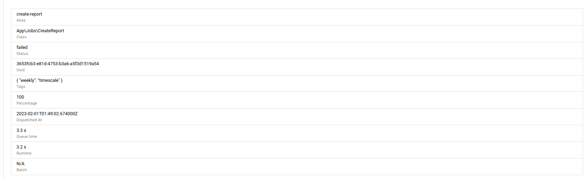
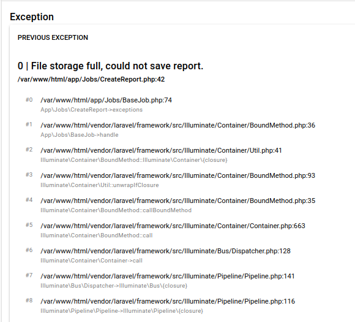

# Viewing a Run

## Selecting retries

By default you will see the latest run.

If this run was started when it previously failed, e.g. it is a retry, you can see and select which run you would like to view from the top.

## See run information

You can see a list of run information

## Run timeline

The timeline will list

- Any status changes
- Any messages sent
- Any signals sent or received
- Any errors

## Exceptions

You can dive into the exception thrown by a failed job

