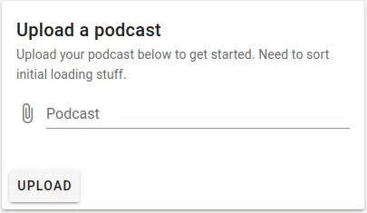

# Laravel Job Status

## What does this package do?

This package saves information about the jobs running in your Laravel application and lets you view realtime and historic data on what's going on in your queue.

It also enhances jobs with two-way communication with your app, the ability to cancel jobs, and to save debug information.

The frontend plugin provides users with instant feedback on background operations, with minimal configuration required.

## When should you use this package?

If you would like an insight into your jobs and how they are performing, either for debugging or observation.

If you need the ability to cancel jobs.

If your users need real-time feedback on background jobs.

## Why should I use this package?

This package shares a lot of features with Laravel Horizon, however Horizon is also a queue runner. This is excellent for a powerful no-fuss queue solution, but it means Horizon doesn't provide as much insight into your jobs. This package works well alongside Laravel Horizon, providing debugging on the jobs passing through Horizon and letting it handle the queue worker.

Laravel provides job batches, which can provide feedback for users. However you have to scaffold this from scratch for every app you work on, and the information you can receive is limited and without the depth this package provides.

## Screenshots

<figure markdown>

  <figcaption>Instant user feedback</figcaption>
</figure>

<figure markdown>

  <figcaption>In depth tracking</figcaption>
</figure>


## Installation

All you need to do to use this project is pull it into an existing Laravel app using composer.

```console
composer require twigger/laravel-job-status
```

You can publish the configuration file by running

```console
php artisan vendor:publish --tag=laravel-job-status-config
```

## Quick-start guide

- [Step 1](./enable-tracking.md) - Enable tracking for at least one job.
- [Step 2](./dashboard/installing.md) - View the history of the job.
- [Step 3](./js/custom-frontend.md) - Give your users instant feedback.
